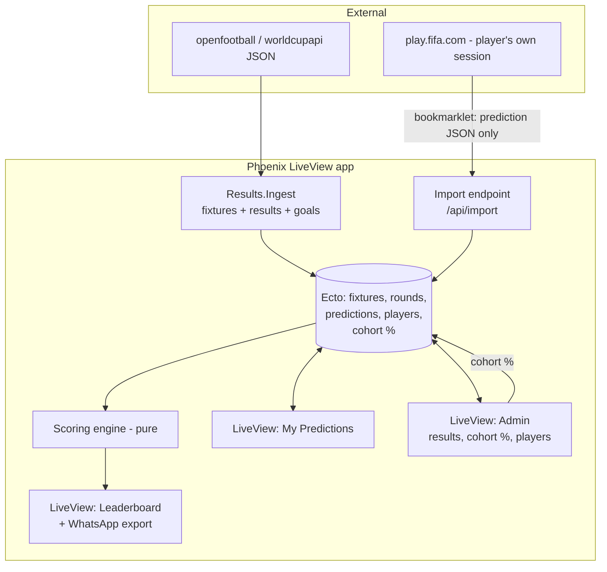

# Plan: Predictex — Private FIFA World Cup 2026 Predictor League

> Approved planning document. Implementation has **not** started — continue locally.
> Game rules reference: [`docs/rules.md`](./rules.md).

## Context

A ~10–15 person prediction league among friends on WhatsApp, mirroring the official
**FIFA Match Predictor** rules (`docs/rules.md`). Joining mid-tournament: the first scored
fixture is **Egypt–Belgium, 20:00 UK**.

Target: an **Elixir / Phoenix LiveView** app on a homelab. The remote planning sandbox has
**no Elixir toolchain**, so implementation is intended to happen **locally**. The intended
shape: hand-written Elixir source (domain logic, scoring engine + tests, schemas, seeds,
bookmarklet) that drops into a project generated with `mix phx.new`. The **scoring engine is
pure Elixir with ExUnit tests** — the most valuable, fully-portable piece.

Key constraints:
- **Results data:** free, no-auth — [openfootball/worldcup.json](https://github.com/openfootball/worldcup.json) (fixtures, FT scores, goal events incl. `owngoal`), with [worldcupapi.com](https://worldcupapi.com/) as a near-live fallback.
- **Prediction import:** players import their own FIFA.com predictions from *their* signed-in browser — auth never reaches our server (bookmarklet pattern). Manual entry/edit always available (fine at 10–15 users).
- **Risky bonus:** FIFA blocks scraping (HTTP 403, no public API). Cohort home/draw/away % are **entered by the admin** per fixture.

## Architecture



## Tech & project setup (run locally)

```
mix phx.new predictex --live               # Postgres + LiveView
mix phx.gen.auth Accounts Player players    # lightweight player login
```
Then add the domain `lib/`, `test/`, `priv/repo/seeds`, and `assets` files;
`mix deps.get && mix ecto.setup && mix test && mix phx.server`.

## Domain model (Ecto schemas + migrations)

- **Round** — `name`, `stage` (`group`|`knockout`), `ordinal` (1–8), `opens_at`/`opened`
  (group rounds open immediately; a knockout round opens once all fixtures of the prior
  round are `completed`). Helper `Rounds.open?/1`.
- **Fixture** — `round_id`, `team1`, `team2`, `group`, `kickoff_at` (UTC), `status`
  (`scheduled`|`live`|`completed`), `home_goals`/`away_goals` (**90-min/FT** per rules),
  `first_scorer_side` (`home`|`away`|nil), `first_scorer_player`, `first_goal_owngoal`
  (bool), `cohort_home_pct`/`cohort_draw_pct`/`cohort_away_pct` (admin, nullable),
  `external_ref` (openfootball match key for idempotent sync).
- **Player** — from `phx.gen.auth`; add `display_name`, `is_admin`.
- **Prediction** — `player_id`, `fixture_id`, `home_goals`, `away_goals`,
  `first_scorer_side`, `first_scorer_player` (knockout only), `booster` (bool).
  Unique on `(player_id, fixture_id)`. **Locked** = `now >= fixture.kickoff_at`
  (computed, enforced in changeset + LiveView; only one `booster=true` per
  `(player_id, round)`).

## Scoring engine — `lib/predictex/scoring.ex` (pure, fully tested)

`Scoring.score(prediction, fixture, stage)` → `%{components: %{...}, base_total, booster,
fixture_total}`. Components (from `docs/rules.md` §7):

| Rule | Points | Notes |
|---|---|---|
| Correct outcome | +10 | sign(pred diff) == sign(actual diff) |
| Correct home goals | +5 | |
| Correct away goals | +5 | |
| Correct goal difference | +5 | |
| Exact score bonus | +5 | both goals correct |
| Risky bonus | +10 | predicted **home OR away win** (not draw), correct, AND `cohort_<side>_pct < 20`. Skipped if cohort % nil |
| First team to score | +5 | knockout only |
| First player to score | +10 | knockout only; **0 if `first_goal_owngoal`** |

`Scoring.round_total(entries, stage)` adds **Round bonus +20** when every fixture outcome
in the round is correct (and the round is complete).

**Decisions baked in (configurable module attributes):**
- **Booster** doubles a *fixture's* total only — **not** the round-level +20 bonus.
- **Knockout** scoring uses the 90-min/FT score (ET & penalties ignored).

ExUnit tests in `test/predictex/scoring_test.exs` cover each component, booster doubling,
risky on/off via cohort %, own-goal first-scorer zeroing, and the round bonus.

## Results ingestion — `lib/predictex/results/ingest.ex`

- `Ingest.sync_schedule/0` / `sync_results/0` pull openfootball JSON, upsert Fixtures by
  `external_ref`, map `score.ft` → `home_goals/away_goals`, derive `first_scorer_side` /
  `first_scorer_player` / `first_goal_owngoal` from the earliest entry across
  `goals1`+`goals2` (respecting `owngoal`).
- Triggered from Admin LiveView ("Sync now") and/or an Oban/`Task` schedule; all fields are
  **admin-overridable**. Code note: verify the source's `ft` excludes ET before trusting it
  for knockout rounds.

## FIFA prediction import (auth-safe) — `assets/bookmarklet.js` + `POST /api/import`

- App serves a **bookmarklet** + instructions on an "Import from FIFA" LiveView. The player,
  signed into play.fifa.com, runs it; it calls FIFA's *same-origin* predictions endpoint
  with the player's existing session, then POSTs **only the prediction JSON** to
  `/api/import` authenticated with **our** app session token. FIFA cookies/headers never
  reach our server.
- The exact FIFA endpoint isn't public (site is 403 to scripted requests). Capture it once
  via browser DevTools → Network and paste the URL into the bookmarklet template.
- **Fallbacks:** paste-JSON box on the same page, and full manual entry/edit in My
  Predictions.

## LiveView surfaces

- **My Predictions** (`/predictions`): per open round, scoreline inputs (+ knockout extras),
  booster toggle (one/round), per-fixture lock at kickoff, Import-from-FIFA link.
- **Leaderboard** (`/`): overall + per-round tables; **"Copy WhatsApp text"** button.
- **Admin** (`/admin`): results sync + manual override, **cohort % entry per fixture**,
  player management, "recompute scores".

## Phased delivery

1. **Core:** Ecto schemas + migrations, pure **scoring engine + tests**, ingestion module,
   seed file with the group-stage schedule, and a `mix predictex.leaderboard` task that
   scores predictions from a JSON file (lets you score fixtures before the UI is live).
2. **App:** `mix phx.new` + `phx.gen.auth`, wire LiveViews (My Predictions, Leaderboard,
   Admin), manual prediction entry for the 10–15 players.
3. **Automation:** FIFA bookmarklet import, knockout extras (first team/player to score),
   automated result sync schedule.

## Verification

- **Scoring:** `mix test` — engine tests assert each rule, booster, risky (cohort
  threshold), own-goal zeroing, and round bonus against worked examples from `docs/rules.md`.
- **Ingestion:** `mix predictex.leaderboard` against a seeded fixture with a known result
  reproduces hand-computed totals.
- **End-to-end:** `mix phx.server`, enter predictions for a few players, set a result +
  cohort % in Admin, confirm the leaderboard and WhatsApp export match the engine's numbers.
